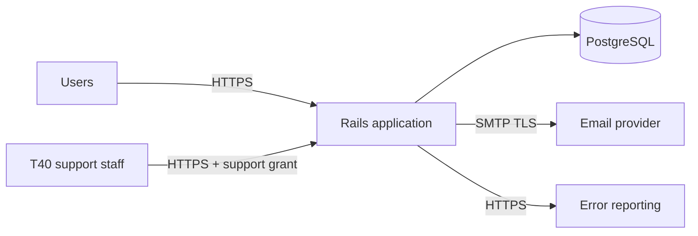

# System Context

## How to complete this document

Describe what this application is for, who uses it, and what it connects to. Keep it short
enough that a new engineer or a procurement reviewer can read it in five minutes. Fill in
every section, replace the example rows, set `status: complete` and record an owner and
review date in the frontmatter. Update this document whenever an actor or external system
is added or removed.

> This template supports evidence gathering; it does not by itself provide ISO 27001,
> SOC 2, Cyber Essentials, WCAG conformance or legal compliance.

## Purpose

_One paragraph: what business problem this application solves and for whom._

## Actors

| Actor | Type | Description | Access route |
|---|---|---|---|
| Account owner | Human | Administers their organisation's account | Browser, passwordless sign-in |
| Account admin | Human | Manages users and data within an account | Browser, passwordless sign-in |
| Account member | Human | Day-to-day use within an account | Browser, passwordless sign-in |
| T40 support staff | Human | Time-limited, audited support access | Browser + `SupportAccessGrant` |
| Operator | Human | Deploys, monitors and maintains the service | Hosting provider console, CI |
| _Add project actors_ | | | |

## External systems

| System | Direction | Purpose | Data exchanged | Protocol |
|---|---|---|---|---|
| Email provider (SMTP) | Outbound | Magic-link sign-in codes, notifications | Email address, sign-in code | SMTP over TLS |
| PostgreSQL | Internal | Primary datastore, queue (Solid Queue), cache | All application data | TLS where networked |
| Error reporting backend | Outbound | Exception reporting (adapter; backend deferred) | Error class, correlation IDs | HTTPS |
| _Add integrations_ | | | | |

## System boundary

_What is inside this system (the Rails monolith, its database, its background workers) and
what is explicitly outside it (identity providers, client systems of record, third-party
services). State which system is authoritative for which data._

## Environments

| Environment | Purpose | Data policy |
|---|---|---|
| development | Local development | Synthetic data only |
| test | Automated tests | Synthetic data only |
| staging | Pre-production verification | Synthetic or irreversibly sanitised data only |
| production | Live service | Real data; controls in this pack apply |

## Key constraints

_List the constraints that shape the architecture: hosting region, data residency,
contractual service levels, client security requirements, budget._

## Context diagram

_Add a diagram (Mermaid is fine) showing actors, this system and external systems._

